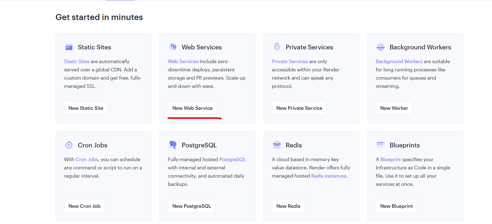
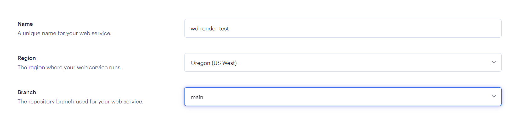

**Please refer to the below given steps while you are watching the video so that your application runs successfully on Render**

--- Render Deploy Video should be here ----

- Open [Render.com](https://render.com/)


- Sign Up to `Render` using your `Github` account


- Add an additional start script to your `package.json` file which is inside the `todo-app/` folder as shown below:

```
"start:prod":"node index.js",
```


Then push the changes to Github.

- Now create a new `Web Service` on the render dashboard



- Then select `Build and deploy from a Git repository`


- Then configure your `Github account` with `Render` and then connect the respective repository for your webservice


- Give a meaningful name to your `Web Service` preferably, with your name included.


- The **Branch** should be set to `main`



- The **Root Directory** should be set to `todo-app`

**Note: There is an update to the video below. Please mention `todo-app` under Root Directory (timestamp: 06:40) because this is with respect to your system's folder structure as shown below**


- The **Runtime environment** should be set to `Node`


- The **Build Command** should be set to:

```
npm install
```

**Note: This will be changed later in the video**


- The **Start Command** should be set to:

```
npm run start:prod
```


- The **Instance Type** should be set to `Free`


- Now `Create Web Service`


- Now open `config.json` file which is inside the `config` folder inside `todo-app`folder

**Note: This will be edited later in the video**


- Now go back to Render dashboard and `Create Postgres DB`


- Provide a unique name for your `PostgreSQL instance`.


- The **Instance Type** should be set to `Free`


And `Create the Database`

- Now go back to Render Dashboard and open your `Postgres DB`


- After openning your `Postgres DB` click on `Connect`


- Then **Copy** the `Internal Database URL` as shown in the video

- Go back to dashboard and open your Render Web Service and go to `Environment Section`


12:02
